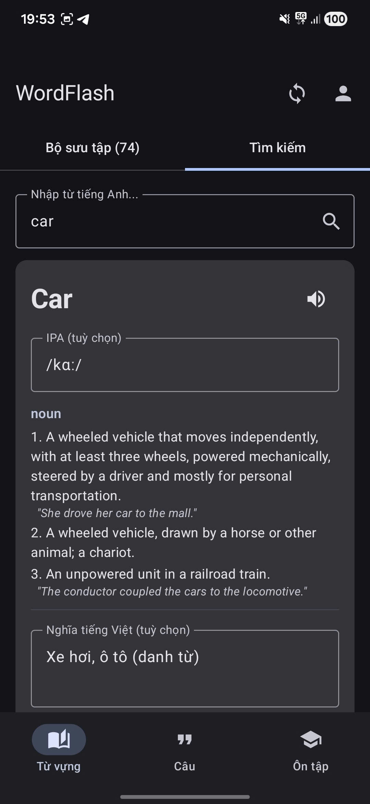
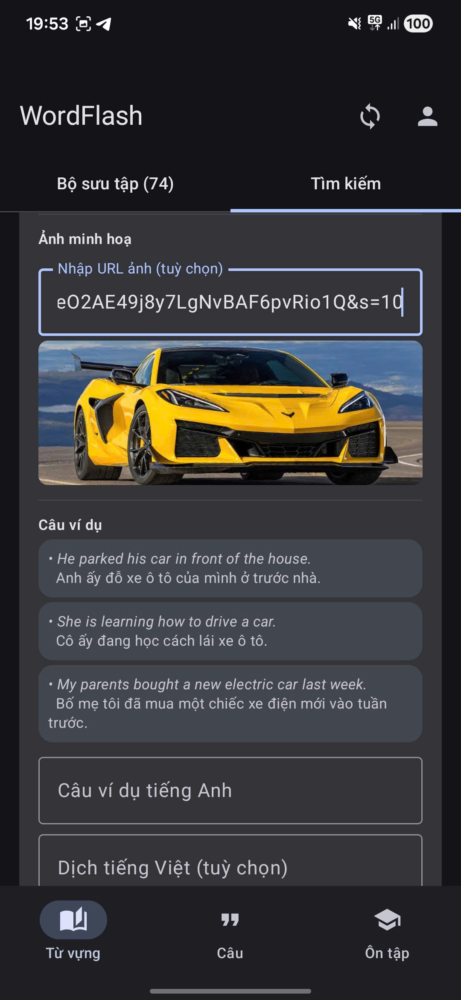
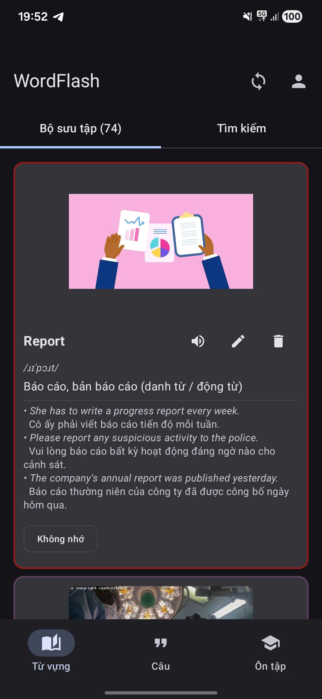
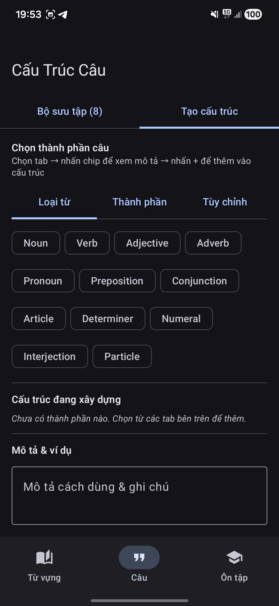
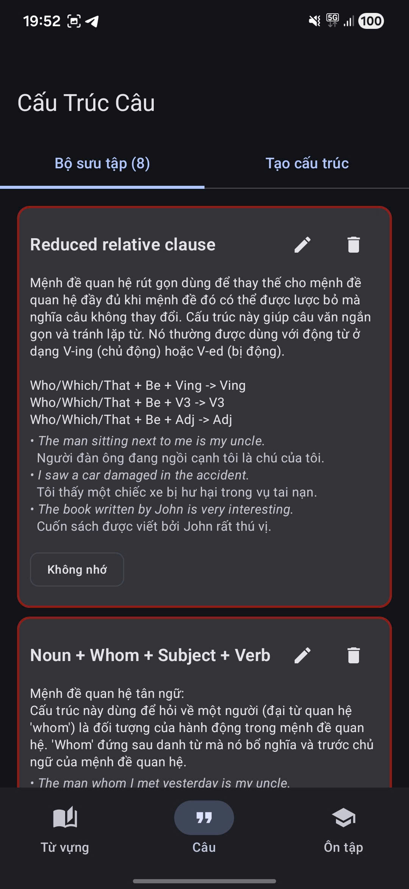
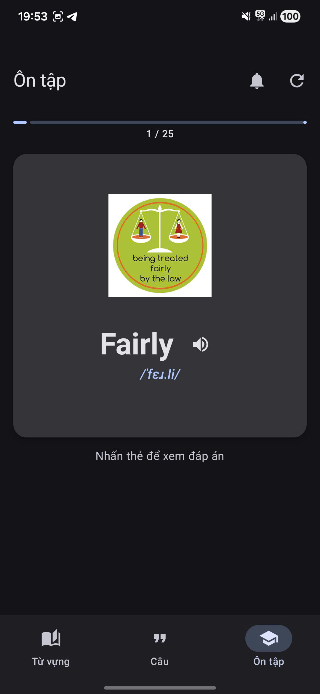
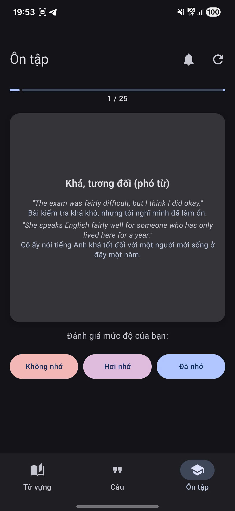

# WordFlash — Ứng Dụng Học Từ Vựng & Cấu Trúc Câu Thông Minh

**WordFlash** là ứng dụng Android giúp học và ghi nhớ từ vựng, cấu trúc câu tiếng Anh thông qua **Flashcard** kết hợp thuật toán **Spaced Repetition (Lặp lại ngắt quãng)**. Dữ liệu được lưu cục bộ bằng Room Database và có thể đồng bộ lên Firebase Firestore.

---

## Màn Hình Ứng Dụng

### 1. Từ Vựng — Tìm Kiếm

<table>
  <tr>
    <td align="center" width="50%">
      <br/>
      <b>Tra từ điển</b><br/>
      Nhập từ tiếng Anh để tra cứu ngay IPA, từ loại, định nghĩa từ Dictionary API. Gemini tự động dịch nghĩa tiếng Việt ngắn gọn kèm từ loại.
    </td>
    <td align="center" width="50%">
      <br/>
      <b>Ảnh & Câu Ví Dụ</b><br/>
      Nhập URL ảnh minh hoạ tuỳ chọn với preview trực tiếp. Gemini tự động sinh 3 câu ví dụ song ngữ EN–VI; người dùng có thể thêm câu ví dụ thủ công trước khi lưu.
    </td>
  </tr>
</table>

---

### 2. Từ Vựng — Bộ Sưu Tập

<table>
  <tr>
    <td align="center">
      <br/>
      <b>Quản Lý Flashcard</b><br/>
      Danh sách flashcard hiển thị ảnh minh hoạ, IPA, nghĩa tiếng Việt và câu ví dụ song ngữ. Chip mức độ ghi nhớ (<i>Không nhớ / Hơi nhớ / Đã nhớ</i>) có thể nhấn để xoay vòng. Border màu thể hiện trực quan mức độ thuộc bài.
    </td>
  </tr>
</table>

---

### 3. Cấu Trúc Câu — Tạo Cấu Trúc

<table>
  <tr>
    <td align="center">
      <br/>
      <b>Sentence Builder</b><br/>
      Chọn thành phần câu từ 3 tab: <b>Loại từ</b> (12 word types), <b>Thành phần</b> (11 sentence roles), <b>Tuỳ chỉnh</b>. Nhấn chip để xem mô tả chi tiết → nhấn + để thêm vào cấu trúc. Nút <i>"Tự động điền từ Gemini"</i> sinh mô tả cách dùng và 3 câu ví dụ EN–VI.
    </td>
  </tr>
</table>

---

### 4. Cấu Trúc Câu — Bộ Sưu Tập

<table>
  <tr>
    <td align="center">
      <br/>
      <b>Quản Lý Cấu Trúc Câu</b><br/>
      Mỗi card hiển thị tên cấu trúc, mô tả ngữ pháp và câu ví dụ song ngữ. Hỗ trợ sửa mô tả, thêm/xoá câu ví dụ, đánh dấu mức độ ghi nhớ.
    </td>
  </tr>
</table>

---

### 5. Ôn Tập — Spaced Repetition

<table>
  <tr>
    <td align="center" width="50%">
      <br/>
      <b>Mặt Trước Flashcard</b><br/>
      Hiển thị từ / cấu trúc câu, ảnh minh hoạ và IPA. Thanh tiến trình và số thứ tự thẻ (VD: 1/25). Nhấn thẻ để lật xem đáp án.
    </td>
    <td align="center" width="50%">
      <br/>
      <b>Mặt Sau — Đánh Giá</b><br/>
      Hiển thị nghĩa tiếng Việt cùng câu ví dụ song ngữ EN–VI. Ba nút đánh giá <i>Không nhớ / Hơi nhớ / Đã nhớ</i> điều chỉnh tần suất xuất hiện của thẻ trong các phiên tiếp theo.
    </td>
  </tr>
</table>

---

## Tính Năng Nổi Bật

| Tính năng | Chi tiết |
|-----------|----------|
| **Tra từ điển** | Dictionary API — IPA, từ loại, định nghĩa, phát âm TTS |
| **Gợi ý từ** | Datamuse API khi không tìm thấy từ trong từ điển |
| **Gemini AI** | Tự động dịch nghĩa VI, sinh câu ví dụ song ngữ, mô tả cấu trúc câu |
| **Spaced Repetition** | Thuật toán trọng số theo mức độ ghi nhớ + số ngày kể từ lần ôn cuối |
| **Sentence Builder** | 12 word types + 11 sentence roles + custom; tạo cấu trúc bằng chip trực quan |
| **Nhắc nhở hàng ngày** | WorkManager — thông báo đẩy nhắc học, kiểm tra đã học hôm nay chưa |
| **Firebase Sync** | Google Sign-In + Firestore đồng bộ flashcard lên đám mây |
| **Giới hạn phiên học** | 20 từ vựng + 5 cấu trúc câu mỗi ngày để tránh quá tải |

---

## Công Nghệ Sử Dụng

| Layer | Công nghệ |
|-------|-----------|
| **Ngôn ngữ** | Kotlin |
| **UI** | Jetpack Compose + Material Design 3 |
| **Kiến trúc** | Clean Architecture + MVVM |
| **Database** | Room Database |
| **Networking** | Retrofit + OkHttp |
| **AI** | Google AI Android SDK (Gemini) |
| **DI** | Dagger Hilt |
| **Ảnh** | Coil (`SubcomposeAsyncImage`) |
| **Background** | WorkManager |
| **Cloud** | Firebase Auth + Firestore |
| **Async** | Kotlin Coroutines + Flow |

---

## Cài Đặt & Chạy

1. Clone repo
2. Tạo file `local.properties` và thêm API key:
   ```
   GEMINI_API_KEY=<your_gemini_api_key>
   ```
3. Kết nối thiết bị Android hoặc khởi động emulator
4. Chạy:
   ```bash
   ./gradlew installDebug
   ```

---

*Dự án được phát triển với sự hỗ trợ của Claude Code (Anthropic).*
